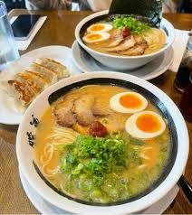

When you're working with a team on a front-end application cloned from a GitHub organization profile, you'll typically need to set up your local environment to ensure everything runs smoothly. Here’s a simplified checklist of what to do:

### Steps to Set Up Your Local Repository

1. **Clone the Repository**:
   ```bash
   git clone <repository-url>
   cd <repository-directory>
   ```

2. **Install Node.js**:
   Make sure you have Node.js installed on your machine. You can check by running:
   ```bash
   node -v
   npm -v
   ```
   If you don't have it installed, download it from the [Node.js website](https://nodejs.org/) and install it.

3. **Install Project Dependencies**:
   Navigate to the project directory (if not already there) and run:
   ```bash
   npm install
   ```
   This command installs all the dependencies listed in the `package.json` file.

4. **Check for Additional Setup Instructions**:
   - Look for a `README.md` file or any other documentation in the repository. It may contain specific setup instructions or dependencies unique to the project.

5. **Environment Variables**:
   If your app requires any environment variables (e.g., API keys), you may need to create a `.env` file in the root directory. Refer to the documentation for details on what variables to include.

6. **Run the Application**:
   After installing dependencies, you can usually start the application with:
   ```bash
   npm start
   ```
   Check the `package.json` for the correct script if it’s different.

### Optional: Install Development Tools
- **Linting/Formatting**: Install ESLint or Prettier if they are used in the project for consistent code style.
- **Testing Framework**: Set up any testing frameworks if the project has tests.

By following these steps, you should have a local copy of the front end set up and ready to contribute. Let me know if you need any further assistance!


Seconds App WireFrame for Mobile:
//Home Page
If not a member, the user can only see the dishes that are around and their ratings.. They can only sort that list from highest to lowest rating and from lowest to highest rating. And they can only search for a dish in the search bar.


How can we make a user sign up?

1. We can just show the list of nearby dishes with their ratings, but no address or restaurant name, that way if they click on it they'll get prompt to sign up or log in.

2. Do not show ratings for non members, just show address of dishes that have less than 5 stars in the database. If the user wants to see the top ones with all the info, they'll be prompted to sign up or log in.

//Log In/ Register Page
For Demo, we will use firebase, demo already logged in.


//Logged In Page
Horizontal carousel
Map (pins of the places for dishes)

//User searches
User to be able to get dishes with the search query
User should be able to get restaurants with the search query

Dish cards take user to Rest - dish page
Rest cards take user to Rest. Page
Dish results take priority
Dish & Rest. collapsible


//Restaurant Map pin page / Restaurant show page.
Search will include First Dish Result if search Dish result carousel
the other buttons will be `call  , Directions, view menu, Rest. ratings

//Dish Page
Ingredients
Rating
Call button and directions button
Rate Dish Link

Notes

Can a user rate the same dish multiple times?(Redundant to rate same dish (No). No multiple ratings. User can only change the rating).

How can we verify if the user actually ordered the dish in order to rate? (Future Feature?) Demo is about showing the positive possibilities. Panelist questions is to address bad aspects/possibilities. e.g. Future feature. api that can confirm legit receipts. AI may not be able to tell if receipt is real - that would skew the data.Give more insight to how complex might be, scale?
Upload a receipt
OCR
Map feature will be at the top based on location. (Mapbox/Google Maps) Google maps is way to go - more vendor focused.
Food icons
Share option for the dish (limit)
API is to get the meals for the restaurant

Meal-Me AI from Collin in North Carolina. 
Rapid API - An API Market Place (we can sell APIs)

Monetization:Restaurant User Flow -Vendors to upload photos?
Paywall for certain features: e.g., allergies, foodcrawl, familyfoodie, other family recommendations can be viewed, group preferences.
How does the end user feel this recommendation came about?

User-focus, not restaurant focus

Sanitization of dishes 
We do not want restaurants to sponsor anything.


//Dish Page
Map options
Click to see specific restaurant on map?
Map option on cards
Map option restaurant


//Mission
At Seconds, our mission is to empower food enthusiasts to discover and rate their favorite dishes, creating a seamless platform that enhances dining experiences. We strive to connect users with highly-rated culinary options tailored to their dietary preferences, making food exploration simple and enjoyable.

            At Seconds, our mission is to celebrate culinary diversity by empowering users to discover and rate exceptional dishes. We focus on providing a platform that makes food exploration accessible, enjoyable, and tailored to personal dietary choices.

            Seconds is dedicated to enhancing the culinary exploration experience. Our mission is to connect users with highly-rated dishes that cater to their dietary preferences, making it effortless to discover and appreciate exceptional food.

            Seconds is committed to enhancing dining choices for everyone. Our mission is to offer a platform that allows users to discover, rate, and save their favorite dishes while catering to their dietary preferences, making food selection effortless and enjoyable.

            At Seconds, our mission is to empower food lovers to effortlessly discover and rate their favorite dishes. We aim to enhance dining experiences by connecting users with highly-rated culinary options tailored to their unique tastes and dietary preferences.


            At Seconds, our mission is to create an accessible and enjoyable dining experience for everyone. We connect users with highly-rated dishes tailored to their preferences, inviting all to explore and rate meals that suit their tastes.

            At Seconds, we aim to connect everyone to exceptional culinary options. Our mission is to empower users—food enthusiasts and casual diners alike—to discover and rate dishes that enhance their dining experiences.

                       ***At Seconds, our mission is to empower users to effortlessly discover and explore exceptional dishes that celebrate culinary diversity. We are dedicated to enhancing each user's unique journey by connecting them with tailored recommendations, inviting everyone to enjoy an enriching and satisfying meal experience.

            ***"At Seconds, we empower users to embark on an enriching culinary journey. Our mission is to provide effortless exploration of tailored, exceptional dishes that connect everyone to a world of diverse tastes and satisfying meals."


                        ***At Seconds, we believe in enriching everyones food journey. Our mission is to provide a platform where users can easily discover and rate dishes, making it simple for all, whether you’re a food lover or just looking for a satisfying meal.

                        Where Great Taste is Rated.

                        Discover the Best, One Bite at a Time.

                        Savor Every Second.
                        Your taste, your journey, your Seconds.

                        Rate, Explore, Enjoy.

                        Find the Best, Forget the Rest

                        Rate what you love, love what you find.

                        Your taste, your journey, your Seconds.

                        Taste the Best, Rate the Rest!

                        Eat, Rate, Celebrate!

                        Rate the Plate, Don’t Hesitate!

                        Discover Delight, Rate it Right

                        Taste and Rate, Don’t Wait

                        Dishes to Explore, Ratings Galore!

                        Satisfy Your Crave, Rate and Rave!

                        Culinary Delight, Rate It Right!

                        Taste, Rate, and Celebrate!

                        Taste and Rate, Celebrate Your Plate!

                        Dine and Shine, One Dish at a Time!

                        Rate Your Plate, Celebrate the Great!

                        Rate and Celebrate Every Plate

                        Taste, Rate, and Celebrate Your Plate

                        Your Tastes, Your Ratings, Your Seconds


At Seconds, we exist to empower food lovers and explorers to effortlessly discover and celebrate exceptional dishes from diverse culinary traditions. We strive to connect people with tailored recommendations, enhancing their dining journeys and making every meal an enriching experience. Our mission is to invite everyone to savor every second of their culinary adventures, creating lasting memories around the table.

At Seconds, we empower everyone to effortlessly discover and explore exceptional dishes that celebrate culinary diversity. Our mission is to enhance every dining journey by connecting individuals with tailored recommendations, inviting all to enjoy enriching and satisfying meal experiences. Together, we celebrate the joy of taste, making each second a delicious exploration. Our mission is to invite everyone to savor every second of their culinary adventures.

At Seconds, we exist to empower food lovers and explorers alike to effortlessly discover and celebrate exceptional dishes from diverse culinary backgrounds. Our mission is to connect individuals with personalized recommendations that enhance their dining journeys, inviting everyone to enjoy enriching, satisfying meal experiences. Through every rating and discovery, we aim to foster a love for food that transcends boundaries, making every second spent savoring flavors a moment to cherish.


import "./App.css";
import { Routes, Route } from "react-router-dom";
import { useState, useEffect } from "react";

// COMPONENTS
import Footer from "./Components/Footer/Footer";
import TopMenuBar from "./Components/TopMenuBar/TopMenuBar";
import SidebarMenu from "./Components/SidebarMenu/SidebarMenu";

// PAGES
import Home from "./Pages/Home";
import Dishes from "./Pages/Dishes";
import DishShow from "./Pages/DishShow";
import FourOFour from "./Pages/FourOFour";
import Login from "./Pages/Login";
import Map from "./Pages/Map";
import About from "./Pages/About";

function App() {

  const [ menuToggle, setMenuToggle ] = useState(false);

  return (
    <div className="main-container">
      <TopMenuBar menuToggle={menuToggle} setMenuToggle={setMenuToggle}/>
      {menuToggle ? <SidebarMenu menuToggle={menuToggle} setMenuToggle={setMenuToggle}/> : 
      <main>
          <Routes>
            <Route path="/" element={<Home />} /> List of highly rated dishs, accessibility to everyone, logic 
            <Route path="/dishes" element={<Dishes />} /> NA
            <Route path="/dishes/:id" element={<DishShow />} /> Ayyoub
            <Route path="/login" element={<Login />} />Niki
            <Route path="*" element={<FourOFour />} Niki
            <Route path="/map" element={<Map />} /> Jorge
            <Route path="/about" element={<About />} /> Niki
          </Routes>
      </main>
      }
      <Footer setMenuToggle={setMenuToggle}/>
    </div>
  );
}

export default App;


I will send you his code, can explain why he did what he did with the useState in the App.jsx page. 

//App.jsx
import "./App.css";
import { Routes, Route } from "react-router-dom";
import { useState, useEffect } from "react";

// COMPONENTS
import Footer from "./Components/Footer/Footer";
import TopMenuBar from "./Components/TopMenuBar/TopMenuBar";
import SidebarMenu from "./Components/SidebarMenu/SidebarMenu";

// PAGES
import Home from "./Pages/Home";
import Dishes from "./Pages/Dishes";
import DishShow from "./Pages/DishShow";
import FourOFour from "./Pages/FourOFour";
import Login from "./Pages/Login";
import Map from "./Pages/Map";
import About from "./Pages/About";

function App() {

  const [ menuToggle, setMenuToggle ] = useState(false);

  return (
    <div className="main-container">
      <TopMenuBar menuToggle={menuToggle} setMenuToggle={setMenuToggle}/>
      {menuToggle ? <SidebarMenu menuToggle={menuToggle} setMenuToggle={setMenuToggle}/> : 
      <main>
          <Routes>
            <Route path="/" element={<Home />} />
            <Route path="/dishes" element={<Dishes />} />
            <Route path="/dishes/:id" element={<DishShow />} />
            <Route path="/login" element={<Login />} />
            <Route path="*" element={<FourOFour />} />
            <Route path="/map" element={<Map />} />
            <Route path="/about" element={<About />} />
          </Routes>
      </main>
      }
      <Footer setMenuToggle={setMenuToggle}/>
    </div>
  );
}

export default App;


//ButtonNav.jsx
import * as React from 'react';
import { Link } from 'react-router-dom'
import Box from '@mui/material/Box';
import CssBaseline from '@mui/material/CssBaseline';
import Paper from '@mui/material/Paper';
import BottomNavigation from '@mui/material/BottomNavigation';
import BottomNavigationAction from '@mui/material/BottomNavigationAction';
import MapIcon from '@mui/icons-material/Map';
import PlaceIcon from '@mui/icons-material/Place';
import RestaurantIcon from '@mui/icons-material/Restaurant';
import FavoriteIcon from '@mui/icons-material/Favorite';


export default function FixedBottomNavigation({ setMenuToggle }) {
  const [value, setValue] = React.useState(0);
  const ref = React.useRef(null);


  return (
    <Box sx={{ pb: 7 }} ref={ref}>
      <CssBaseline />
 
      <Paper sx={{ position: 'fixed', bottom: 0, left: 0, right: 0 }} elevation={3}>
        <BottomNavigation
          showLabels
          value={value}
          onChange={(event, newValue) => {
            setValue(newValue);
          }}
        >
          <BottomNavigationAction label="Map" icon={<PlaceIcon />} component={Link} to="/map" onClick={() => setMenuToggle(false)}/>
          <BottomNavigationAction label="Home" icon={<RestaurantIcon />} component={Link} to="/" onClick={() => setMenuToggle(false)}/>
          <BottomNavigationAction label="Dishes" icon={<FavoriteIcon />} component ={Link} to="/dishes" onClick={() => setMenuToggle(false)}/>
        </BottomNavigation>
      </Paper>
    </Box>
  );
}

// https://mui.com/material-ui/react-bottom-navigation/

//Dish.jsx
import { useNavigate } from "react-router-dom"

//DishDetails.jsx

import { useState, useEffect } from 'react'
import { useParams, useNavigate, Link } from 'react-router-dom'
export default function DishDetails() {
  let navigate = useNavigate()
  const API = import.meta.env.VITE_API_URL;

  const [hoverRating, setHoverRating] = useState(0);
  const plateImages = [
    "https://t3.ftcdn.net/jpg/03/06/75/66/360_F_306756617_moZMl2JAPW5rwxj8TBggViHvKtX1QDK2.jpg",
    "https://www.shutterstock.com/image-vector/hands-holding-fork-spoon-empty-260nw-1292484178.jpg",
  ];


    const[dish,setDish]=useState({ 'dish_name': '', 'dish_image': '', 'avg_rating': 1, 'restaurant_name': '','latitude':'','longitude':''})
    let { id } = useParams()
    function ratingDishes(number){
      let string=' '
      for(let i=0;i<number;i++){
        string+='🍽️ '
      }
      return string

    }
      
  useEffect(() => {
    console.log(id)
    fetch(`${API}/dishes/${id}`)
      .then((res) => {
      return res.json()
      })
      .then(resJSON => {
        
        setDish(resJSON)
        console.log(dish)
    
      })
      .catch(() => {
      navigate("/notfound")
    })

  }, [id, navigate])
  //{dish_id: 1, dish_name: 'Margherita Pizza', dish_image: 'https://cookieandkate.com/images/2021/07/margherita-pizza-recipe-1-2.jpg', avg_rating: '4.50', restaurant_name: 'Joes Pizza', …}
  return (
    <div className='dish-details-container'>
        <h3 className='dish-details_dish-name'>{dish.dish_name}</h3>
        
        <h3 className='dish-details_rating-title'>Rating:</h3>

                <h3 className='dish-details_rating-content'>{ratingDishes(dish.avg_rating)}</h3>
                

        <div className='dish-details_restaurant-info'>
        <h3 className='dish-details_restaurant-name'>{dish.restaurantname}</h3>
        <div className='dish-details_restaurant-buttons'>
          <button className='dish-details_restaurant-buttons_call'>Call</button>
          <button className='dish-details_restaurant-buttons_directions'>Directions</button>
        </div>
        </div>
      
        <div className="rating-container">
          
            <h3 className='dish-details_ask-for-rating'>"Did you try this dish? Please rate it from 1 to 5 !"</h3>
          <div className="dish-details_plate-rating">
            {[1, 2, 3, 4, 5].map((rating) => (
               setHoverRating(rating)}
              onMouseLeave={() => setHoverRating(0)}
              onClick={() => {}}
              />
            ))}
          </div>
        </div>
        <button className='dish-details-rating-button'>Rate Dish</button>


        
    </div>
  )
}

//
export default function Dish({item,index}) {
    let navigate = useNavigate()

  return (
    <div onClick={()=>navigate(`/dishes/${item.id}`)}  className="nearbyoptions-container" key={index}>
    <div className="nearbyoptions-item">
    
      <div className="nearbyoptions-item-name&address">
      <h5>{item.name}</h5>
      <p className="neabyoptions-item-address">{item.address}</p>
      </div>
     
    </div>
  </div>
  )
}

//Footer.jsx
// COMPONENTS
import MobileNav from "../MobileNav/MobileNav.jsx";
import ButtonNav from "../ButtonNav/ButtonNav.jsx";

import React from 'react'

export default function Footer({ setMenuToggle }) {
  return (
    <footer>
      <ButtonNav setMenuToggle={setMenuToggle}/>
      {/* <MobileNav /> */}
    </footer>
  )
}

//MapComponent.jsx
import "./MapComponent.css";
import { useState, useEffect } from "react";
import { APIProvider, Map, AdvancedMarker, InfoWindow } from "@vis.gl/react-google-maps"; 

//COMPONENTS
import SlidingCarousel from "../SlidingCarousel/SlidingCarousel";

export default function MapComponent() {

    const API = import.meta.env.VITE_API_URL;
    const API_KEY = import.meta.env.VITE_API_KEY;

    //SEARCH BAR
    const [ search, setSearch ] = useState("");

    //RADIUS
    const [ radius, setRadius ] = useState(100);
    

    //FILTERED DISH SEARCH
    const [ filteredDishSearch, setFilteredDishSearch ] = useState([]);

    //FILTERED RESTAURANT SEARCH
    const [ filteredRestSearch, setFilteredRestSearch ] = useState([]);

    //SELECTED MARKER
    const [ selectedMarker, setSelectedMarker ] = useState(null);

    //RESTAURANTS ARRAY
    const [ restaurants, setRestaurants ] = useState([]);

    //DISHES ARRAY
    const [ dishes, setDishes ] = useState([]);

    //DISHES LOCATIONS ARRAY
    const [ dishesLocations, setDishesLocations ] = useState([]);

    //LOCATIONS INSIDE RADIUS
    const [ locationsInRadius, setLocationsInRadius ] = useState([]);

    //CURRENT COORDINATES
    const [ currentLocation, setCurrentLocation ] = useState({
        lat: null,
        lng: null,
    });

    const [ error, setError ] = useState(null);

    //FUNCTIONS WITH MATH LOGIC TO CALCULATE IF LOCATION IS INSIDE A GIVEN RADIUS
    function calculateDistance(point1, point2) {
        const earthRadiusMiles = 3959;
        const dLat = (point2.lat - point1.lat) * Math.PI / 180;
        const dLon = (point2.lng - point1.lng) * Math.PI / 180;
        const a = Math.sin(dLat/2) * Math.sin(dLat/2) + Math.cos(point1.lat * Math.PI / 180) * Math.cos(point2.lat * Math.PI / 180) * Math.sin(dLon/2) * Math.sin(dLon/2);
        const c = 2 * Math.atan2(Math.sqrt(a), Math.sqrt(1-a));
        return earthRadiusMiles * c;
    }

    useEffect(() => {
        if (currentLocation) {
            setLocationsInRadius(dishesLocations.filter((dish, index) => calculateDistance(currentLocation, {lat: Number(dish.latitude), lng: Number(dish.longitude)}) <= radius));
        }
    },[currentLocation, radius])

    useEffect(() => {
        if (navigator.geolocation) {
            navigator.geolocation.getCurrentPosition((position) => {
                setCurrentLocation({
                    lat: Number(position.coords.latitude),
                    lng: Number(position.coords.longitude),
                });
            }),
            (error) => {
                setError(error.message);
            };
        } else {
            setError("Geolocation is not supported by this browser.");
        }
    },[]);

    const mapContainerStyle = {
        width: '400px',
        height: '400px',
    };
    
    const center = {
        lat: 37.7749,
        lng: -122.4194,
    }
    
    useEffect(() => {
        fetch(`${API}/restaurants`)
        .then((response) => response.json())
        .then(res => {
            setRestaurants(res)
        })
    },[]);

    useEffect(() => {
        fetch(`${API}/dishes/locations`)
        .then((response) => response.json())
        .then(res => {
            setDishesLocations(res)
        })
    },[]);

    function handleSearch (e) {
        setSearch(e.target.value)
    }

    //Filtering the search

    useEffect(() => {
        const filtered = dishesLocations.filter((dish, index) => dish.dish_name.includes(search) || dish.restaurant_name.includes(search));
        if (filtered.length > 0) {
            setFilteredDishSearch(filtered.filter((dish, index) => calculateDistance(currentLocation, {lat: Number(dish.latitude), lng: Number(dish.longitude)}) <= radius))
        } else {
            setFilteredDishSearch([]);
        }
    },[search])

    //-------------------------------------------------------------------------------------------------


    //JUST FOR TESTING PURPOSES - CAN DELETE AFTER EVERYTHING IS WORKING FINE
    useEffect(() => {
        console.log(restaurants, "Restaurants");
    },[restaurants])

    useEffect(() => {
        console.log(dishesLocations, "Dishes Locations");
    },[dishesLocations])

    useEffect(() => {
        console.log(search, "Search");
    },[search]);

    useEffect(() => {
        console.log(filteredDishSearch, "Filtered Search")
    },[filteredDishSearch])

    useEffect(() => {
        console.log(filteredRestSearch, "Filtered Restaurants")
    },[filteredRestSearch])

    useEffect(() => {
        console.log(locationsInRadius, "Locations Inside Radius");
    },[locationsInRadius])

    useEffect(() => {
        console.log(radius, "Radius");
    }, [radius])

    return (
        <div className="map-container">
            <div className="upper-container">
                
                <input className="search-bar" type="text" placeholder="Search dish or restaurant" value={search} onChange={handleSearch} onClick={() => setSelectedMarker(null)}/>
                <label className="radius">
                    Radius:
                    <input className="radius-input" type="number" onChange={(e) => setRadius(e.target.value)}/>
                </label>
                
            </div>
            {currentLocation.lat && currentLocation.lng ?
            <div className="google-map">
            <APIProvider apiKey={API_KEY} onLoad={() => console.log("Maps API loaded")}>
                <Map
                    style={{width: "100%", height: "400px"}}
                    defaultZoom={10}
                    defaultCenter={ currentLocation }
                    mapId={"757334e0ef14872c"}
                    onCameraChanged={(event) => {
                        console.log("Camera changed: ", event)
                    }}>
                        {filteredDishSearch.map((restaurant, index) => (
                            <AdvancedMarker key={index} position={{lat: Number(restaurant.latitude), lng: Number(restaurant.longitude)}} onClick={() => setSelectedMarker({lat: Number(restaurant.latitude), lng: Number(restaurant.longitude), name: restaurant.restaurant_name})}/>
                        ))}
                        {selectedMarker && (
                            <InfoWindow position={{lat: Number(selectedMarker.lat), lng: Number(selectedMarker.lng)}}>
                                <div>
                                    <h2>{selectedMarker.name}</h2>
                                    <p>Latitude: {selectedMarker.lat}</p>
                                    <p>Longitude: {selectedMarker.lng}</p>
                                </div>
                            </InfoWindow>
                        )}
                </Map>
            </APIProvider>
            </div>
            : <p>Loading...</p>}
            {currentLocation.lat && currentLocation.lng && filteredDishSearch.length > 0 ? 
                <div style={{width:"100%", display:"flex", flexDirection:"row"}}>
                    <SlidingCarousel filteredDishSearch={filteredDishSearch}/>
                </div>
          :  <p style={{fontSize:"30px"}}>No Results</p>}
          </div>
      )
  }

//MobileNav.jsx
import './MobileNav.css'
import React from 'react'
import { Link } from 'react-router-dom'

export default function MobileNav() {
  return (
    <div className="mobile-nav">
      <Link to="/map">
        <div className="mobile-nav-item">
          <div className="nav-icon"></div>
          <span className="nav-text">Map</span>
        </div>
      </Link>
      <Link to="/">
        <div className="mobile-nav-item">
          <div className="nav-icon"></div>
          <span className="nav-text">Home</span>
        </div>
      </Link>
      <Link to="/dishes">
        <div className="mobile-nav-item">
          <div className="nav-icon"></div>
          <span className="nav-text">Dishes</span>
        </div>
      </Link>
      <Link to="/rate">
        <div className="mobile-nav-item">
          <div className="nav-icon"></div>
          <span className="nav-text">Rate</span>
        </div>
      </Link>
    </div>
  )
}

//NearbyOptions.jsx
import SearchBar from "../../Components/SearchBar/SearchBar";
import Dish from "../Dish/dish";
// import { useState, useEffect } from "react";
import { useState,useEffect } from "react";
export default function NearByOptions() {
  const [ dishesLocations, setDishesLocations ] = useState([]);
  const [ locationsInRadius, setLocationsInRadius ] = useState([]);
  const [ search, setSearch ] = useState("");

  const API = import.meta.env.VITE_API_URL;
  const API_KEY = import.meta.env.VITE_API_KEY;

  const [ currentLocation, setCurrentLocation ] = useState({
    lat: null,
    lng: null,
});
useEffect(() => {
  console.log(locationsInRadius, "Locations good");
},[locationsInRadius])
  function calculateDistance(point1, point2) {
    const earthRadiusMiles = 3959;
    const dLat = (point2.lat - point1.lat) * Math.PI / 180;
    const dLon = (point2.lng - point1.lng) * Math.PI / 180;
    const a = Math.sin(dLat/2) * Math.sin(dLat/2) + Math.cos(point1.lat * Math.PI / 180) * Math.cos(point2.lat * Math.PI / 180) * Math.sin(dLon/2) * Math.sin(dLon/2);
    const c = 2 * Math.atan2(Math.sqrt(a), Math.sqrt(1-a));
    return earthRadiusMiles * c;
}

useEffect(() => {
    if (currentLocation) {
        setLocationsInRadius(dishesLocations.filter((dish, index) => calculateDistance(currentLocation, {lat: Number(dish.latitude), lng: Number(dish.longitude)}) <= 110));

    }
},[currentLocation])
useEffect(() => {
  const filtered = dishesLocations.filter((dish, index) => dish.dish_name.includes(search) || dish.restaurant_name.includes(search));
  if (filtered.length > 0) {
      setFilteredDishSearch(filtered.filter((dish, index) => calculateDistance(currentLocation, {lat: Number(dish.latitude), lng: Number(dish.longitude)}) <= 100))
  }
  console.log(filtered, "Filtered");
},[search])

useEffect(() => {
    if (navigator.geolocation) {
        navigator.geolocation.getCurrentPosition((position) => {
            setCurrentLocation({
                lat: Number(position.coords.latitude),
                lng: Number(position.coords.longitude),
            });
        }),
        (error) => {
            setError(error.message);
        };
    } else {
        setError("Geolocation is not supported by this browser.");
    }
},[]);
useEffect(() => {
  fetch(`${API}/dishes/locations`)
  .then((response) => response.json())
  .then(res => {
      setDishesLocations(res)
      
  })
},[]);
  let dummy=[
    {  id: 1,
      "address": "123 Main St, Springfield, IL",
      "name": "Springfield Library",
      "image": "https://www.unileverfoodsolutions.us/dam/global-ufs/mcos/NAM/calcmenu/recipes/US-recipes/sandwiches/spicy-mayo-fried-chicken-sandwich/crispychickensandwich_1206x709.jpg"
    },
    { id: 2,
      "address": "456 Elm St, Oakwood, TX",
      "name": "Oakwood Community Center",
      "image": "https://www.unileverfoodsolutions.us/dam/global-ufs/mcos/NAM/calcmenu/recipes/US-recipes/sandwiches/spicy-mayo-fried-chicken-sandwich/crispychickensandwich_1206x709.jpg"
    },
    { id: 3,
      "address": "789 Pine St, Maple City, CA",
      "name": "Maple City Park",
      "image": "https://www.unileverfoodsolutions.us/dam/global-ufs/mcos/NAM/calcmenu/recipes/US-recipes/sandwiches/spicy-mayo-fried-chicken-sandwich/crispychickensandwich_1206x709.jpg"
    },
    { id: 4,
      "address": "101 Birch Ave, Greenfield, WI",
      "name": "Greenfield Arts Center",
      "image": "https://www.unileverfoodsolutions.us/dam/global-ufs/mcos/NAM/calcmenu/recipes/US-recipes/sandwiches/spicy-mayo-fried-chicken-sandwich/crispychickensandwich_1206x709.jpg"
    },
   
  ]
  
  return (
    <div className="home-main-container">

      {/* <h4>What are you going to eat today</h4> */}
      <SearchBar/>
      <h4 className="highly-rated-nearby-options">Highly rated nearby options</h4>
      {dummy.map((item,index)=>{
        return(
         <Dish item={item} index={index}/>
        )
      })}

   

     
    </div>
  );
}

//SearchBar.jsx
export default function SearchBar() {

    return (
      <div className="search-bar_container">
        <input className='search-bar_input' type="text" placeholder="Search for a dish" />
      </div>
    )
  }

//SidebarMenu.jsx
import "./SidebarMenu.css";
import { useEffect } from "react";


import { useNavigate } from "react-router-dom";

import anime from "animejs";

export default function SidebarMenu ({ menuToggle, setMenuToggle }) {

    const navigate = useNavigate();

    useEffect(() => {
        anime({
            targets: ".sidebar-container",
            keyframes: [
                {translateX: '-100vw'}
            ],
            duration: 2000,
            easing: "easeOutExpo",
            zindex: 1,
            position: "relative",
        })
    },[])

    return (
        <div className={`sidebar-container`}>
            <div className="links" onClick={() => {
                navigate("/login");
                setMenuToggle(false);
                }
            }>
                <p className="link-text">Log In</p>
            </div>
            <div className="links" onClick={() => {
                navigate("/about");
                setMenuToggle(false);
                }
            }>
                <p className="link-text">About Us</p>
            </div>
            <div className="links" onClick={() => {
                navigate("/contact-us");
                setMenuToggle(false);
                }
            }>
                <p className="link-text">Contact Us</p>
            </div>
        </div>
    )
}

//SlidingCarousel
import "./SlidingCarousel.css";
import { BsArrowLeftCircleFill, BsArrowRightCircleFill } from "react-icons/bs";
import { useState } from "react";


export default function SlidingCarousel({ filteredDishSearch }) {

    const [ slide, setSlide ] = useState(0);

    const nextSlide = () => {
        setSlide(slide === filteredDishSearch.length-1 ? 0 : slide + 1);
    }

    const prevSlide = () => {
        setSlide(slide === 0 ? filteredDishSearch.length-1 : slide - 1);
    }

    return (
            <div className="carousel-container">
                <BsArrowLeftCircleFill className="arrow arrow-left" onClick={prevSlide}/>
            {filteredDishSearch.map((dish, index) => {
                return (
                    <div key={index} className={slide === index ? "single-card" : "single-card hidden"}>
                        
                        <p className="titles">{dish.dish_name}</p>
                        <p className="titles">{dish.restaurant_name}</p>  
                    </div>
                )
            })}
                <BsArrowRightCircleFill className="arrow arrow-right" onClick={nextSlide}/>
                <span className="indicators">
                    {filteredDishSearch.map((_, index) => {
                        return (
                            <button key={index} className={slide === index ? "indicator" : "indicator inactive"} onClick={null}></button>
                        )
                    })}
                </span>
            </div>
    );
};

//TopMenuBar
import "./SlidingCarousel.css";
import { BsArrowLeftCircleFill, BsArrowRightCircleFill } from "react-icons/bs";
import { useState } from "react";


export default function SlidingCarousel({ filteredDishSearch }) {

    const [ slide, setSlide ] = useState(0);

    const nextSlide = () => {
        setSlide(slide === filteredDishSearch.length-1 ? 0 : slide + 1);
    }

    const prevSlide = () => {
        setSlide(slide === 0 ? filteredDishSearch.length-1 : slide - 1);
    }

    return (
            <div className="carousel-container">
                <BsArrowLeftCircleFill className="arrow arrow-left" onClick={prevSlide}/>
            {filteredDishSearch.map((dish, index) => {
                return (
                    <div key={index} className={slide === index ? "single-card" : "single-card hidden"}>
                        
                        <p className="titles">{dish.dish_name}</p>
                        <p className="titles">{dish.restaurant_name}</p>  
                    </div>
                )
            })}
                <BsArrowRightCircleFill className="arrow arrow-right" onClick={nextSlide}/>
                <span className="indicators">
                    {filteredDishSearch.map((_, index) => {
                        return (
                            <button key={index} className={slide === index ? "indicator" : "indicator inactive"} onClick={null}></button>
                        )
                    })}
                </span>
            </div>
    );
};

//TopMenuBar.jsx
import "./TopMenuBar.css";
import { useNavigate } from "react-router-dom";

export default function TopMenuBar({ menuToggle, setMenuToggle }) {

    const navigate = useNavigate();

    return (
        <div className="top-menubar-container">
             {
                navigate("/");
                setMenuToggle(false);}
            }/>
            <div className="hamburger-menu-container" >
                <label className="hamburger-menu" >
                    <input id="check" className=""  type="checkbox"  checked={menuToggle} onClick={() => setMenuToggle(!menuToggle)}/>
                </label>
            </div>
        </div>
    )
}

//Login.jsx
import { useState } from 'react';
import './Login.css'; // Import the CSS file for styling
import { FaBars } from 'react-icons/fa'; // Import hamburger icon

export default function Login() {
  const [email, setEmail] = useState('');
  const [password, setPassword] = useState('');

  const handleSubmit = (e) => {
    e.preventDefault();
    // simulate login process (replace with actual authentication logic)
    alert(`Email: ${email}, Password: ${password}`);
    // add the authentication logic here
  };

  return (
    <div className="login-container">
      <div className="login-box">
        <form onSubmit={handleSubmit} className="login-form">
          <div className="form-group">
            <input
              type="email"
              placeholder="Email"
              value={email}
              onChange={(e) => setEmail(e.target.value)}
              required
              className="input-field"
            />
          </div>
          <div className="form-group">
            <input
              type="password"
              placeholder="Password"
              value={password}
              onChange={(e) => setPassword(e.target.value)}
              required
              className="input-field"
            />
          </div>
          <button type="submit" className="login-button">Log In</button>
          <h5 className="signup-prompt">
            Not Registered? <a href="/register">Sign Up</a>
          </h5>
        </form>
      </div>
      <div>
        <p>Take the guess work out of the equation...</p>
      </div>
      <div className="food-images">
        
        
        
      </div>
      <div>
        <p>Ready to explore?</p>
      </div>
    </div>
  );
}